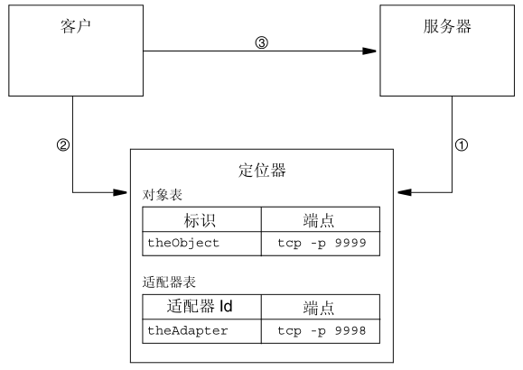

# ICE1.3笔记
Internet Communications Engine (ICE)
# 前言
1. DCOM Windows独占，.NET替代，跨平台不好
2. CORBA 平台老化，复杂，供应商问题
3. Web Server 性能问题，安全问题
4. SOAP 性能要求太高

# 一、ICE综述
> Ice 是一种面向对象的中间件平台。从根本上说，这意味着 Ice 为构建面向对象的客户－服务器应用提供了工具、 API 和库支持。Ice 应用适合在异种环境中使用：客户和服务器可以用不同的编程语言编写，可以运行在不同的操作系统和机器架构上，并且可以使用多种网络技术进行通信。

## ICE 协议
> Ice 提供了一种 RPC 协议，既可以把 TCP/IP、也可以把 UDP 用作底层传输机制。此外，Ice 还允许你把 SSL 用作传输机制，让客户与服务器间的所有通信都进行加密。

**Ice 协议定义了：**
- 一些消息类型，比如请求和答复类型
- 协议状态机，确定客户与服务器以怎样的序列交换不同的消息类型，同时还包括相关的 TCP/IP 连接建立和关闭语义
- 编码规则，确定在线路上怎样表示数据的类型
- 每种消息类型的头，其中含有像这样的细节：消息类型、消息尺寸、所使用的协议及编码版本

1. Ice 还支持在线路上进行压缩.
2. Ice 协议适用于构建高效的事件转发机制.
3. Ice 协议还适用于构建双向操作：如果服务器想要把一条消息发送给客户提供的某个回调对象，这个回调对象可以通过客户原来创建的连接传给服务器。如果客户在防火墙后面，连接只能外出，不能进入，这种特性就特别重要。

**对象持久**
Ice 拥有内建的对象持久服务，叫作 Freeze。 Freeze 能够让我们轻松地在数据库中存储对象状态：你用 Slice 定义你的对象要存储的状态， Freeze编译器会生成代码，用以在数据库中存储和取回对象状态。 Freeze 使用Berkeley DB 作为它的缺省数据库。

### Ice 服务
Ice 核心为分布式应用开发提供了一个完善的客户－服务器平台。但现实应用需要的常常不止是远地通信能力：你通常还需要拥有这样的能力：随需启动服务器、把代理分发给客户、分发异步事件、配置你的应用、分发应用补丁，等等。
在 Ice 中有一些服务， 能够提供上述特性及其他一些特性。

**IcePack**
IcePack 是 Ice 的定位服务，用于在使用间接绑定时把符号性的 （symbolic）适配器名解析为协议－地址对。 除了这样的定位服务， IcePack 还提供了其他特性：
- IcePack 允许你注册服务器，进行自动启动：当客户发出请求时，服务器无需在运行， IcePack 会在第一个客户请求到达时，随需启动服务器。
- IcePack 支持部署描述符 （deployment descriptors），能让你轻松地配置含有若干服务器的复杂应用。
- IcePack 提供了一种简单的对象查找服务，客户可用来获取它们感兴趣的对象的代理。

**IceBox**
IceBox 是一种简单的应用服务器，可用于协调许多应用组件的启动和停止。应用组件可以作为动态库、而不是进程进行部署。

**IceStorm**
IceStorm 是一种发布－订阅服务，能够解除客户与服务器的耦合。在本质上， IceStorm 充当的是事件分发交换机。发布者把事件发给这个服务，由它发给订阅者。这样，发布者发布的单个事件就可以发送给多个订阅者。事件按照主题进行分类，订阅者会指定它们感兴趣的主题。只有那些与订阅者感兴趣的主题相吻合的主题才会发给这个订阅者。这个服务允许你指定服务质量标准， 让应用在可靠性和性能之间进行适当的折衷。

**IcePatch**
IcePatch 是一种软件修补服务。 你可以用它来轻松地把软件更新分发给客户。客户可以简单地连接到 IcePatch，请求获得特定应用的更新。这个服务会自动检查客户的软件的版本，并以一种压缩形式下载任何更新过的应用组件，从而节省带宽。

**Glacier**
Glacier 是 Ice 防火墙服务：它能让客户与服务器通过防火墙安全地进行通信，且又不牺牲安全性。 客户－服务器之间的通信数据使用公钥证书进行了完全的加密，并且是双向的。 Glacier 支持相互认证，以及安全的会话管理。

# 二、Hello World
**编写 Slice 定义**
编写任何 Ice 应用的第一步都是要编写一个 Slice 定义，其中含有应用所用的各个接口。
```slice
// Printer.ice
interface Printer
{
	void printString(string s);
};
```
我们的 Slice 定义含有一个接口，叫作 Printer 。目前，我们的接口非常简单，只提供了一个操作，叫作 printString 。

*编译用于 C++ 的 的 Slice *
要创建我们的 C++ 应用，第一步是要编译我们的 Slice 定义，生成 C++代理和骨架。在 UNIX 上，你可以这样编译定义：`$ slice2cpp Printer.ice`
slice2cpp 编译器根据这个定义生成两个 C++ 源文件：Printer.h 和Printer.cpp。

```c++
// 服务器代码
#include <Ice/Ice.h>
#include <Printer.h>
using namespace std;

class PrinterI : public Printer {
public:
	virtual void printString(const string & s,
	const Ice::Current &);
};

void PrinterI::printString(const string & s, const Ice::Current &)
{
	cout << s << endl;
}

int main(int argc, char* argv[])
{
	int status = 0;
	Ice::CommunicatorPtr ic;
	try {
		ic = Ice::initialize(argc, argv);
		Ice::ObjectAdapterPtr adapter = ic->createObjectAdapterWithEndpoints("SimplePrinterAdapter", "default -p 10000");
		Ice::ObjectPtr object = new PrinterI;
		adapter->add(object,Ice::stringToIdentity("SimplePrinter"));
		adapter->activate();
		ic->waitForShutdown();
	} catch (const Ice::Exception & e) {
		cerr << e << endl;
		status = 1;
	} catch (const char * msg) {
		cerr << msg << endl;
		status = 1;
	}
	if (ic)
		ic->destroy();
	return status;
}
```

```c++
// 客户端代码
#include <Ice/Ice.h>
#include <Printer.h>
using namespace std;

int main(int argc, char * argv[])
{
	int status = 0;
	Ice::CommunicatorPtr ic;
	try {
		ic = Ice::initialize(argc, argv);
		Ice::ObjectPrx base = ic->stringToProxy("SimplePrinter:default -p 10000");
		PrinterPrx printer = PrinterPrx::checkedCast(base);
		if (!printer)
			throw "Invalid proxy";
		printer->printString("Hello World!");
	} catch (const Ice::Exception & ex) {
		cerr << ex << endl;
		status = 1;
	} catch (const char * msg) {
		cerr << msg << endl;
		status = 1;
	}
	if (ic)
		ic->destroy();
	return status;
}
```


# 三、高级ICE


# 四、ICE服务


//////////////////实践/////////////////////

# 服务器

> 配置文件中用到的文件夹必须事先创建好


**registry.cfg 注册查询服务程序配置**  
```
#registry config for icegrid
IceGrid.Registry.Client.Endpoints=tcp -p 4061
IceGrid.Registry.Server.Endpoints=tcp
IceGrid.Registry.Internal.Endpoints=tcp
IceGrid.Registry.AdminPermissionsVerifier=IceGrid/NullPermissionsVerifier
IceGrid.Registry.Data=c:\ice_registry
IceGrid.Registry.DynamicRegistration=1
Ice.LogFile=c:\ice.log
```
- 运行注册服务 `icegridregistry --Ice.Config=C:\project\Ice_Hellow\registry.cfg`  
- 运行管理程序 `icegridadmin -u test -p test --Ice.Default.Locator="IceGrid/Locator:tcp -h localhost -p 4061"`  

**node.cfg 节点程序配置**  
```
#指定主注册节点的位置
Ice.Default.Locator=IceGrid/Locator:tcp -h localhost -p 4061
#指定节点1的名称
IceGrid.Node.Name=node1
#设置节点1相关数据的存储目录
IceGrid.Node.Data=c:\ice_node1\data
#指定节点1用于监听客户端连接的端口号
IceGrid.Node.Endpoints=tcp -p 5062
Ice.StdErr=c:\ice_node1\node.stderr.log
# 指定错误日志文件
Ice.StdOut=c:\ice_node1\node.stdout.log
```  
- 运行grid节点 `icegridnode --Ice.Config=C:\project\Ice_hellow\node.cfg`  

```simple.xml
<icegrid>
  <application name="Simple">
    <node name="node1">
      <server id="SimpleServer" exe="C:\ZeroC\Ice-3.6.3\demos\cpp\IceGrid\simple\server.exe" activation="on-demand">
        <adapter name="Hello" endpoints="tcp -h localhost -p 5062">
          <object identity="hello" type="::Demo::Hello" property="Identity"/>
        </adapter>
        <property name="IceMX.Metrics.Debug.GroupBy" value="id"/>
        <property name="IceMX.Metrics.Debug.Disabled" value="1"/>
        <property name="IceMX.Metrics.ByParent.GroupBy" value="parent"/>
        <property name="IceMX.Metrics.ByParent.Disabled" value="1"/>
      </server>
    </node>
  </application>
</icegrid>
```

- 配置IceGrid XML文件，通过IceGridAdmin执行`application add simple.xml`,服务程序被添加到serverlist中  

*负载均衡，通过grid.xml配置得到*  

# 客户端  
## 客户端访问验证  
[Glacier2 Access Control](https://doc.zeroc.com/display/Ice36/Securing+a+Glacier2+Router)   
- [Password Authentication](https://doc.zeroc.com/display/Ice36/Securing+a+Glacier2+Router#SecuringaGlacier2Router-PasswordAuthentication)
- [Certificate Authentication](https://doc.zeroc.com/display/Ice36/Securing+a+Glacier2+Router#SecuringaGlacier2Router-CertificateAuthentication)
- [Interaction with a Permissions Verifier](https://doc.zeroc.com/display/Ice36/Securing+a+Glacier2+Router#SecuringaGlacier2Router-InteractionwithaPermissionsVerifier)
- [Obtaining SSL Credentials for a Router Client](https://doc.zeroc.com/display/Ice36/Securing+a+Glacier2+Router#SecuringaGlacier2Router-ObtainingSSLCredentialsforaRouterClient)


**Password File**
使用PBKDF2库进行处理后的密码 [Click](https://doc.zeroc.com/display/Ice36/Getting+Started+with+Glacier2#GettingStartedwithGlacier2-WritingaPasswordFile)  

- 开启配置项 Glacier2.CryptPasswords=passwords
- 密码辅助脚本 > pip install zeroc-icehashpassword
- 生成一个密码：
```
> icehashpassword
Password:
$5$rounds=110000$5rM9XIDChkgEu.S3$ov7yip4NOi1wymAZmamEv1uKPQRB0WzasoJsWMpRT19 
```

-------------------------------------

Ice中所有的接口和类都继承于Ice::Object对象,Ice::Object对象拥有以下基础方法：  
> ice_ping(); //尝试与服务器进行通信一次。  
> ice_isA(str); //判断是否是某种类型  
> ice_id(); //返回最深层次的ID  
> ice_ids(); // 返回类型ID序列  
> ice_hash(); // 类的哈希值  


local关键字修饰的类和接口都只能本地访问，本地实现。一般用来进行平台差异化实现。  

Slice文件中一般性参数：  
`void say(string txt); -> void say(const ::std::string &);` txt默认为输入参数，使用了const关键字。  
如果需要返回值，有两种方式：  
- `void say(out string txt); -> void say(::std::string &);` txt使用out修饰，则没有const关键字。  
- `string say();` 将所需要的值作为函数返回值使用。  

Ice::Application 派生的类，可以自动进行初始化等操作，局限性是：它是一个单体类，只能进行一个通信。  
Ice::Service 派生的服务，还封装了低级的针对特定平台的初始化和关闭步骤。  

```c++
#include <Ice/Ice.h>
#include <Ice/Service.h>
class MyService : public Ice::Service {
protected:
    virtual bool start(int, char * []);
private:
    Ice::ObjectAdapterPtr _adapter;
};
bool
MyService::start(int argc, char * argv[])
{
    _adapter = communicator()->createObjectAdapter("MyAdapter");
    _adapter->addWithUUID(new MyServantI);
    _adapter->activate();
    return true;
}
int main(int argc, char * argv[])
{
    MyService svc;
    return svc.main(argc, argv);
}
```

Service::main 成员函数会执行下面的任务序列：  
1. 扫描参数向量，看其中是否有保留的选项、让程序作为系统服务运行。还有一些保留选项可用于管理任务。  
2. 让程序准备好作为系统服务运行 （如果有必要的话）。  
3. 按照一个 IceUtil::CtrlCHandler （参见 15.11 节），以进行适当的信号处理。  
4. 调用 initializeCommunicator 成员函数，获取一个通信器。你可以使用 communicator 成员函数来访问通信器实例。  
5. 调用 start 成员函数。如果 start 返回表示失败的 false， main 就销毁通信器，并立即返回。  
6. 调用 waitForShutdown 成员函数，这个函数会阻塞到 shutdown 被调用。  
7. 调用 stop 成员函数。如果 stop 返回 true， main 就认为应用已经成功终止。  
8. 销毁通信器。  
9. 得体地 （gracefully）终止系统服务 （如果有必要的话）。  

如果 Service::main 捕捉到未被处理的异常，在日志中就会记载一条描述性的消息，然后通信器销毁，服务终止。  

Ice::Service  成员函数子类可以用 Ice::Service 中的虚成员函数来拦截 main 成员函数的活动。所有这些虚成员函数 （除了 start）都有缺省实现。  
- Ice::CommunicatorPtr
initializeCommunicator(int & argc, char * argv[])初始化通信器。缺省实现调用 Ice::initialize，并把指定的参数向量传给它。
- void interrupt()
信号处理器调用它来表示收到了信号。缺省实现调用 shutdown 成员函数。
- bool shutdown()
让服务器开始关闭的过程。缺省实现调用通信器的 shutdown。如果关闭已成功开始，子类必须返回 true，否则返回 false。
- bool start(int argc, char * argv[])
允许子类执行它的启动活动，比如扫描所提供的参数向量、识别命令行选项，创建对象适配器，以及注册 servants。如果启动成功，子类必须返回 true，否则返回 false。
- bool stop()
允许子类在终止之前进行清理。缺省实现什么也不做，只是返回true。如果服务成功停止，子类必须返回 true，否则返回 false。
- void waitForShutdown()
无限期地等待服务关闭。缺省实现会调用通信器的waitForShutdown。

下面描述类定义中的非虚成员函数：
- void disableInterrupt()
禁用 Ice::Service 的信号处理行为。禁用之后，信号会被忽略。
- void enableInterrupt()
启用 Ice::Service 的信号处理行为。启用之后，如果有信号发生， interrupt 成员函数会被调用。
- static Service * instance()
返回 Ice::Service 单体实例。
- int main(int argc, char * argv[])
提供 Ice::Service 类的主逻辑。在本节的前面已经描述了这个函数所执行的任务。如果成功，它返回 EXIT_SUCCESS，否则返回EXIT_FAILURE。
- void syserror(const std::string & msg) const
- void error(const std::string & msg) const
- void warning(const std::string & msg) const
- void trace(const std::string & msg) const
为方便使用通信器的日志记录器而提供的函数。 syserror 成员函数包括了系统的当前错误代码的描述。

- bool win9x() const
如果程序是在 Windows 95/98/ME 上运行，就返回真。这个函数只能在 Windows 平台上使用。

在 Unix 平台上， Ice::Service 能识别以下命令行选项： 
- --daemon
指明程序应该作为看守运行。这涉及到创建一个后台子进程，Service::main 将在这个子进程中执行其任务。在子进程成功调用start
成员函数之前父进程不会终止。除非另外收到指示，否则Ice::Service 会把子进程的当前工作目录变更为根目录，并关闭所有无用的文件描述符。注意，
在通信器初始化之前，各文件描述符不会关 闭，也就是说，在这段时间里，标准输入、标准输出，以及标准错误都 可以使用。例如， IceSSL
插件可能需要在标准输入上 提示输入口令， 而如果设置了 Ice.PrintProcessId， Ice 可能要在标准输出上打印 子进程 id。 
- --noclose
阻止 Ice::Service 关闭无用的文件描述符。在调试和诊断过程 中，这可能会很有用，因为 这样一来，你就可以通过看守的标准输出和标准错误进行输出了。 
- --nochdir 
阻止 Ice::Service 变更当前工作目录。 --noclose 和 --nochdir 选项只能和--daemon 一起指定。在传给 start 成员函数的参数向量中，这些选项会被移除。 

Win32 服务
在 Win32 平台上,如果指定了--service 选项， Ice::Service 会 把应用作为 Windows 服务启动： 
- --service NAME 
作为名叫 NAME 的Windows 服务启动。在传给 start 成员函数的 参数向量中，这个选项会被移除。用 shell脚本启动看守常常会带来不确定性，上述行为消除了这一不确定性，因为它确保 了命令调用不会在看守准备好接收请求之前就完成。在 Windows
95/98/ME 上不支持 Windows 服务。但是，在应用作为 Windows服务运行之前，它必须先被安装，因此， Ice::Service 类还支持另外一些的命令行选项，用于执行管理活动： 
- --install NAME
[--display DISP] [--executable EXEC] [ARG ...] 安装 NAME 服务。如果指定了 --display 选项，就把DISP 用作服 务的显示名，否则就使用 NAME。如果指定了 --executable 选项 ， 就把 EXEC用作服务的可执行路径名，否则就使用可执行文件的路径名 来调用 --install。其他任何参数都会不加改变地传给 Service::start成员函数。注意，在启动时传给服务的参数集中， 这个命令会自动增加命令行参数 --service NAME，因此，你不需要 显式地指定这些选项。 
- --uninstall NAME 
移除 NAME 服务。如果服务目前是活动的，在反安装之前，必须先 使它停止。 
- --start NAME [ARG...] 
启动 NAME 服务。其他任何参数都会不加改变地传给 Service::start 成员函数。 
- --stop NAME 
停止 NAME 服务。如果指定的管理命令不止一个，或者在使用 --service 的同时还使用 了管理命令 ，就会发生错误。在执行了管理命令之后，程序会立即终止。
Ice::Service 类支持 Windows 服务控制代码 SERVICE_CONTROL_INTERROGATE 和SERVICE_CONTROL_STOP。在收 到 SERVICE_CONTROL_STOP 时， Ice::Service 会调用 shutdown 成员函数。 

日志记录考虑事项
当应用作为 Unix 看守或 Windows 服务运行时， Ice::Logger 通常并不适用，因为它的输出会发往标准错误，从而会丢失。应用可以实现定制的 日志记录器，也可以使用 Ice 提供的其他日志记录器： 
- 在Unix上，通过Ice.UseSyslog属性， 你可以选用一种使用syslog设 施的日志记录器实现。 
- 在 Windows 上，通过Ice.UseEventLog 属性，你可以让日志消息被记 录到 Windows 事件消息中。这个日志记录器实现会自动在注册表中增加必要的键，以让服务使用事件日志。 

注意，在为 Windows 服务的启动做准备时， Ice::Service 会创建一个临时的 Windows 事件日志记录器实例，在通信器成功初始化、为通信器 配置的日志记录器可用之前，都会使用这个临时的日志记录器。因此，即
使一个失败的应用被配置成使用另外的日志记录器实现，在 Windows 事件 日志中也有可能已经记录了有用的诊断信息。 如果 Ice::Service的一个子类需要手工安装日志记录器实现，这个子类应该重新定义 initializeCommunicator 成员函数。

IceUtil::Mutex // 一般锁  
IceUtil::RecMutex // 递归锁  
IceUtil::RWRecMutex // 递归读写锁  
Monitor<Mutex> // 监控器  
Monitor<RecMutex> // 递归监控器  
```c++
IceUtil::RecMutex _mutex; // Recursive mutex
IceUtil::RecMutex::Lock lock(_mutex);

IceUtil::RWRecMutex _fileMutex; // Read-write mutex
IceUtil::RWRecMutex::RLock lock(_fileMutex); // Read lock
IceUtil::RWRecMutex::WLock lock(_fileMutex); // Write lock

IceUtil::RWRecMutex _mutex;
IceUtil::RWRecMutex::TryWLock lock(_mutex, IceUtil::Time::seconds(2));

IceUtil::Monitor<IceUtil::Mutex>::Lock lock(*this); // wait/notify
```

IceUtil::Thread::run();
```c++
#include <vector>
#include <IceUtil/Thread.h>
// ...
Queue q;
class ReaderThread : public IceUtil::Thread {
    virtual void run() {
        for (int i = 0; i < 100; ++i)
            cout << q.get() << endl;
    }
};
class WriterThread : public IceUtil::Thread {
    virtual void run() {
        for (int i = 0; i < 100; ++i)
            q.put(i);
    }
};
int main()
{
    vector<IceUtil::ThreadControl> threads;
    int i;
    // Create five reader threads and start them
    //
    for (i = 0; i < 5; ++i) {
        IceUtil::ThreadPtr t = new ReaderThread;
        threads.push_back(t->start());
    }
    
    // Create five writer threads and start them
    //
    for (i = 0; i < 5; ++i) {
        IceUtil::ThreadPtr t = new WriterThread;
        threads.push_back(t->start());
    }
    // Wait for all threads to finish
    //
    for (vector<IceUtil::ThreadControl>::iterator i = threads.begin(); i != threads.end(); ++i) {
        i->join();
    }
}
```

Ice run time 的主进入点由本地接口 Ice::Communicator 表示。
Ice::Communicator 的一个实例与一些运行时资源是关联在一起的：
- 客户端线程池
客户端线程池会确保，在客户端，至少有一个线程可用于接收对未完成请求的答复。这确保了不会发生死锁。例如，如果服务器在操作实现中回调客户，即使客户正在等待同一服务器答复它的请求，客户端接收者线程也能处理来自服务器的请求。客户端线程池还被用于异步方法调用 （AMI），用以避免在回调中发生死锁 （参见第 17 章）。
- 服务器端线程池
这个线程池里面的线程负责接受到来的连接，并处理来自客户的请求。
- 配置属性
Ice run time 的各个方面可以通过属性进行配置。每个通信器都有自己的配置属性集 （参见第 14 章）。
- 对象工厂
为了实例化从已知基类派生的类，通信器维护有一组对象工厂，能够替 Ice run time 对类进行实例化 （参见 6.14.4 节和 8.14.1 节）。
- 一个日志记录器对象
日志记录器对象实现了 Ice::Logger 接口，并负责确定 Ice run time产生的日志消息的处理方式 （参见 16.14 节）。
- 一个统计对象
统计对象实现了 Ice::Stats 接口，通信器会把通信流量 （发送和接收字节数）告知该对象 （参见 16.15 节）。
- 一个缺省路由器
路由器实现了 Ice::Router 接口。 Glacier （参见第 24 章）使用了路由器来实现 Ice 的防火墙功能功能。
- 一个缺省定位器
定位器是用于把对象标识解析为代理的对象。定位器对象被用于构建定位服务，比如 IcePack （参见第 20 章）。
- 一个插件管理器
插件是用于给通信器增加特性的对象。例如， IceSSL （参见第 23章）被实现成插件。每个通信器都有一个插件管理器，这个管理器实现Ice::PluginManager 接口，通过它，你可以访问通信器的插件集。
- 对象适配器
对象适配器负责分派到来的请求，并把每个请求传给正确的servant。使用不同通信器的对象适配器和对象完全是相互独立的。特别地：
    - 每个通信器都使用自己的线程池。
    例如，这意味着，如果一个通信器耗尽了用于处理到来请求的线程，只有使用该通信器的对象会受影响。使用其他通信器的对象有自己的线程池，因而不受影响。
    - 跨越不同通信器的并置调用不会被优化，而使用同一通信器的并置调用则能避免产生大部分调用分派开销。

通信器的接口是用 Slice 定义的。下面是其部分接口：  
```
module Ice {
	local interface Communicator {
		string proxyToString(Object* obj);
		Object* stringToProxy(string str);
		ObjectAdapter createObjectAdapter(string name);
		ObjectAdapter createObjectAdapterWithEndpoints(string name,string endpoints);
		void shutdown();
		void waitForShutdown();
		void destroy();
		// ...
	};
// ...
};
```
通信器提供了一些操作：
- proxyToString
- stringToProxy

这两个操作允许你把代理转换成串化表示，或进行反向转换。  
- createObjectAdapter
- createObjectAdapterWithEndpoints

这两个操作创建新的对象适配器。每个对象适配器都与一个或更多传输端点关联在一起。一个对象适配器通常拥有一个传输端点。但是，一个对象适配器也可以提供多个传输端点。如果是这样，这些端点可以通往同一组对象，但代表访问这些对象的不同手段。这很有用，例如，服务器在防火墙后面，但必须让内部和外部的客户都能访问它；把适配器同时绑定到内部和外部接口，就可以其中任何一个接口访问在服务器中实现的对象了。  

createObjectAdapter 根据配置信息 （参见第 20 章）来确定把自己绑定到哪个端点，而 createObjectAdapterWithEndpoints 允许你为新适配器指定传输端点。你通常会优先于 createObjectAdapterWithEnd-points 使用 createObjectAdapter 。这样，就能把与传输机制相关的信息 （比如主机名和端口号）放在 源码外面，通过改变属性，你可以对应用进行重配置 （于是，在传输端点需要改变时，不用重新进行编译）。  

每个对象适配器都维护有一个叫作 活动 servant 映射表 （active servant map）的数据结构。 活动 servant 映射表 （简称为 *ASM*）是一个查找表，用于把对象标识映射到 servant。如果在适配器的 ASM 中，客户请求所包含的对象标识没有对应的条目，适配器就会把 ObjectNotExistException 返回给客户。  

```
module Ice {
local interface ObjectAdapter {
	// ...
	Object* add(Object servant, Identity id);
	Object* addWithUUID(Object servant);
	void remove(Identity id);
		// ...
	};
	void activate();
	void hold();
	void waitForHold();
	void deactivate();
};
```

Current 对象的定义是：
```
module Ice {
	local dictionary<string, string> Context;
	enum OperationMode { Normal, \Nonmutating, \Idempotent };
	local struct Current {
		ObjectAdapter adapter;  // 分派当前请求的对象适配器, 通过 getCommunicator 再访问通信器
		Identity id; // id 成员提供当前请求的对象标识  
		FacetPath facet; // 
		string operation; // 含有正在被调用的操作的名字  
		OperationMode mode;
		Context ctx; // 这个调用的当前上下文  
	};
};
```

servant 定位器是一种本地对象，你负责实现它，并把它系到对象适配器上。适配器一旦有了 servant 定位器，它会和平常一样查询 ASM，对 servant 进行定位。如果在 ASM 中能找到与该请求对应的 servant，请求就会分派给这个 servant。但是，如果在 ASM 没有与该请求的对象标识对应的条目，对象适配器就会回调 servant 定位器，让它为该请求提供servant。  
```
module Ice {
	local interface ServantLocator {
		Object locate( Current curr,
		out LocalObject cookie);
		void finished( Current curr,
		Object servant,
		LocalObject cookie);
		void deactivate();
	};
};
```
注意， ServantLocator 是一个本地接口。为了创建实际的 servant 定位器实现，你必须定义一个从 Ice::ServantLocator 派生的类，并实现locate 、 finished ，以及 deactivate 操作。  

Servant  定位器注册对象适配器不会自动了解到你创建了一个 servant 定位器。相反，你必须显式地向对象适配器注册 servant 定位器：  
```
module Ice {
	local interface ObjectAdapter {
		// ...
		void addServantLocator(ServantLocator locator,
		string category);
		ServantLocator findServantLocator(string category);
		// ...
	};
};
```

Ice::Context
在 6.11.1 和 8.11.1 中，代理的各重载方法都有一个拖尾的参数，类型是const Ice::Context & (C++) 或 java.util.Map (Java)。这个参数的Slice 定义是：
```
module Ice {
	local dictionary<string, string> Context;
};
```
可以看到，上下文就是一个把串映射到串的词典，或者从概念上说，上下文就是一系列名 - 值对。每当有请求要发往服务器时，这个词典的内容 （如果有的话）都会随同请求一起整编，也就是说，如果客户在上下文中放入一些名 - 值对，并在发出调用时使用这个上下文，服务器就将能使用客户所发送的这些名 - 值对。  

对于单向代理，我们不能使用 checkedCast，因为checkedCast 要求服务器作出答复，而单向代理当然不允许那样的答复。如果你想要使用安全的向下转换，你可以首先把双向代理向下转换成实际的对象类型，然后再获取单向代理.  

Ice::Logger  
在你创建通信器时，会实例化一个缺省的日志记录器。缺省的日志记录器会记录标准的错误输出。除了错误消息以外， trace 操作还有一个 cate-gory 参数；这样，你可以把输出发给一个过滤器，把来自不同子系统的跟踪输出分开。
你可以设置和获取与一个通信器相关联的日志记录器：
```
module Ice {
	local interface Communicator {
		void setLogger(Logger log);
		Logger getLogger();
	};
};
```

Ice::Stats  
Ice run time 通过 Ice::Stats 接口报告，所有的操作调用在线路上发送和接收的字节数：
```
module Ice {
	local interface Stats {
		void bytesSent(string protocol, int num);
		void bytesReceived(string protocol, int num);
	};
	local interface Communicator {
		setStats(Stats st);
		// ...
	};
};
```
要注册你的实现，你必须实例化 MyStats 对象，然后调用通信器的setStats：
```
Ice::StatsPtr stats = new MyStats;
communicator->setStats(stats);
```

异步方法调用 (AMI) / 异步方法分派 (AMD)  

数值类型的数据总是使用 "little-endian" 字节序进行编码 （大多数机器都使用 "little-endian" 字节序，所以 Ice 数据编码 “正确”的时候要比不正确的时候多）。  

尺寸和计数是按下面两种方式中的一种进行编码的：  
1. 如果元素的数目少于 255，尺寸就被编码成单个 byte ，指示元素的数目。
2. 如果元素的数目多于或等于 255，尺寸就被编码成一个值为 255 的byte ，再跟上一个 int ， 指示元素的数目。

> bool 单个字节，值 1 表示 true ， 0 表示 false
> byte 一个不作解释的字节
> short 两个字节 (LSB、 MSB)
> int 四个字节 (LSB .. MSB)
> long 八个字节 (LSB .. MSB)
> float 四个字节 (23 位小数尾数、 8 位指数、符号位 )
> double 八个字节 (52 位小数尾数、 11 位指数、符号位)  

无论是客户还是服务器，都可以发起连接关闭。在客户端，连接关闭由Active Connection Management (ACM) 触发 ( 参见 XREF)， ACM 会自动回收空闲了一段时间的连接。  

如果要进行压缩，除了头以外的整个消息都会使用 bzip2 算法进行压缩. 出于效率上的考虑， Ice 协议引擎不压缩小于 100 字节的消息. 并非所有语言或所有映射都支持压缩。  

(binary transport)[https://forums.zeroc.com/discussion/962/can-ice-support-binary-data] 同学学习 IcePath2 getFileCompressed_async 部分代码优化。  

定位器：  
  

客户使用对象标识方式来引导一个首要对象，由这个对象提供指向 “使用对象适配器方式的次级对象”的代理。  
要把定位器功能集成进客户应用，只需进行配置就行了：Ice.Default.Locator 属性的值必须指定定位器对象的串化代理。  

```
MyAdapter.Locator=... // 这个属性的优先级高于 Ice.Default.Locator 属性。  
Ice.Default.Locator=... // 如果没有提供特定的Locator使用这个  
MyAdapter.AdapterId=theAdapter
MyAdapter.Endpoints=default
```
这个配置把定位器标识符 theAdapter 指派给名为 MyAdapter 的对象适配器。这个对象适配器的端点将使用缺省协议和系统指派的端口号。在激活时，对象适配器向定位器 （其代理在 Ice.Default.Locator 中提供）注册这个端点，从而使得客户能通过对象适配器代理方式使用这个适配器。  

定位器设施由 Ice::Locator 接口代表，这是一个普通的 Slice 接口，可以有多种实现。如果 Ice run time 配置了一Ice::Locator 代理，它会自动使用这个定位器来进行间接绑定。  

```
Ice.Default.Router=Glacier/router:tcp -h 5.6.7.8 -p 8000 // 默认router
Glacier.Router.Endpoints=tcp -h 5.6.7.8 -p 8000  // 对外固定IP，固定端口  
Glacier.Router.Client.Endpoints=tcp -h 5.6.7.8 // 对内(局域网) 系统端口随机  
Glacier.Router.Server.Endpoints=tcp -h 10.0.0.1 // 对内提供的端点
```

icebox包裹服务程序，一般是dll。  

-----

**Ice  配置属性**  
Ice.Config  
--Ice.Config --Ice.Config=1 --Ice.Config=config_file    
这个属性必须用 --Ice.Config 、 --Ice.Config=1 、或 --Ice.Config= config_file 选项在命令行上设置。  
如果 Ice.Config 属性是空的，或被设成 1， Ice run time 会检查ICE_CONFIG 环境变量的内容，取得配置文件的路径名。否则， Ice.Config必须被设成配置文件的路径名 ( 可以是相对或绝对路径名）。其他的属性值会从指定的配置文件中读取。   

Ice.Trace.GC=num  
垃圾收集器跟踪级别：  
> 0 不跟踪垃圾收集器 ( 缺省 )。  
> 1 显示已收集的实例的总数、已检查的实例的总数、在收集器中化肥的时间 （以毫秒为单位），以及收集器的运行次数。  
> 2 和 1 一样，但还在每次运行收集器时生成一条跟踪消息。  


Ice.Trace.Network=num  
网络跟踪级别：  
> 0 不跟踪网络 ( 缺省 )。  
> 1 跟踪连接的建立和关闭。  
> 2 和 1 一样，但更详细。  
> 3 和 2 一样，但另外还跟踪数据的传送。  

Ice.Trace.Protocol=num  
协议跟踪级别：  
> 0 不跟踪协议 ( 缺省 )。  
> 1 跟踪 Ice 的协议消息。  

Ice.Trace.Retry=num

请求重试 （request retry）的跟踪级别：  
> 0 不跟踪请求重试 ( 缺省 )。  
> 1 跟踪 Ice 操作调用的重试。  
> 2 另外也跟踪 Ice 端点的使用。  

Ice.Trace.Slicing=num  
切断的跟踪级别：  
> 0 不跟踪切断活动 ( 缺省 )。
> 1 跟踪接收者不知道的、因而将被切断的所有异常和类类型。

**Ice  对象适配器属性**  
name.AdapterId=id  
> 为名为 name 的对象适配器指定标识符。在使用同一个定位器实例的所有对象适配器的范围内，这个标识符必须是唯一的。如果用 name.Locator 或Ice.Default.Locator 定义了定位器代理，这个对象适配器将在激活时用定位器注册表来设置其端点。

name.Endpoints=endpoints  
> 把对象适配器 name 的端点设成 endpoints。

name.Locator=locator  
> 为名为 name 的对象适配器指定一个定位器。其值是指向 Ice 定位器接口的串化代理。

name.RegisterProcess=num  
> 如果 num 被设成大于零的值，名为 name 的对象适配器将向定位器注册表注册服务器。注册发生在对象适配器的初始激活阶段，在这个阶段对象适配器会创建一个实现 Ice::Process 接口的 servant，用一个 UUID 添加这个servant，并用 Ice.ServerId 属性的值做服务器 id，向定位器注册表注册其代理。 servant 通过调用对象适配器的通信器的  shutdown 来实现 shutdown操作。

name.Router=router  
> 为名为 name 的对象适配器指定一个路由器。其值是指向 Glacier 路由器控制接口的串化代理。在定义了路由器之后，对象适配器可以就用原来的连接接收来自路由器的回调，这样路由器就不必再建立回到对象适配器的连接了。  
> 一个路由器只能被指派给一个对象适配器。如果你为多个对象适配器指定同一个路由器，就会产生不确定的行为。缺省值是没有路由器。  

Ice.PrintAdapterReady=num  
> 如果 num 被设成大于零的值，对象适配器会在初始化完成之后，在标准输出上打印 "adapter_name ready"。如果有脚本需要等待对象适配器准备就绪，这个属性很有用。  

**Ice  插件属性**  
Ice.Plugin.name=entry_point [args]
定义一个要在通信器初始化过程中安装的插件。
> 在 C++ 里， entry_point 的形式是 basename[,version]:function 。basename 和可选的 version 用于构造 DLL 或共享库的名字。如果没有提供版本，就会使用 Ice 的版本。 function 是具有 C 链接方式的某个函数的名字。  
> 例如，进入点 MyPlugin,2.3:create 意味着名为 libMyPlugin.so.2.3 的共享库名 （Unix）或 MyPlugin23.dll （Windows）。此外，如果你在Windows 上构建的是 Ice 的调试版本，在版本的后面会自动加上一个 d （例如， MyPlugin23d.dll ）。
> 在 Java 里， entry_point 是某个类的名字。  

**Ice线程池属性**  
name.Size=num  
> name 是线程池的名字。客户端线程池的名字是 Ice.ThreadPool.Client ，缺省的服务器端线程池的名字是 Ice.ThreadPool.Server 。此外，每个对象适配器可以有自己的线程池。在这种情况下，线程池的名字是adapter_name .ThreadPool 。让对象适配器有自己的线程池，可以确保在分派某些 Ice 对象上的请求时，总有一定数量的线程可用，从而避免因为线程饥饿而发生死锁。
> num 是线程池一开始的线程数，也是最少线程数。 Ice.Thread-Pool.Client 和 Ice.ThreadPool.Server 的缺省值是 1，对象适配器线程池的缺省值是零 , 也就是说，在缺省情况下，对象适配器使用的是缺省的服务器端线程池。
> 只有在进行嵌套的 AMI 调用时，客户端线程池才需要有多个线程。如果没有使用 AMI，或者 AMI 调用不是嵌套的 （也就是说， AMI 回调方法没有调用 Ice 对象的其他任何方法），那么就不需要把客户线程池中的线程数设成大于一的值。

name.SizeMax=num  
> num 是线程池 name 的最大线程数。 Ice 中的线程池可以基于平均负载因数、动态地增长和缩减。线程池最大只会增长到  SizeMax 所指定的数目，最小只会缩减到 Size 所指定的数目。SizeMax 的缺省值是 Size 的值，意味着在缺省情况下，线程池不会动态增长。  

name.SizeWarn=num  
> 当线程中只有 num 个活动线程时，会打印 "low on threads" 警告。 SizeWarn的缺省值是 SizeMax 指定的值的 80%。  

**Ice 的 的 Default 和 和 Override  属性**  
Ice.Default.Protocol=protocol  
> 如果某个端点指定使用的协议是 default ，就使用该属性指定的协议。缺省值是 tcp 。

Ice.Default.Host=host  
> 如果某个端点没有指定主机名 （也就是，没有 -h host 选项），就会使用这个属性的 host 值来做主机名。缺省值是本地主机名。

Ice.Default.Router=router  
> 指定所有代理的缺省路由器。其值是一个指向 Glacier 路由控制接口的串化代理。可以用 ice_router() 操作来替换某个代理的缺省路由器。缺省值是没有路由器。

Ice.Default.Locator=locator  
> 为所有代理和对象适配器指定一个缺省定位器。其值是一个指向 IcePack 定位器接口的串化代理。可以用 ice_locator() 操作来替换 （override）某个代理的缺省定位器。缺省值是没有定位器。IcePack 定位器的对象标识是 IcePack/Locator 。它在 IcePack 的客户端点上侦听。例如，如果 IcePack.Registry.Client.Endpoints 被设成 tcp -p 12000 -h localhost ，IcePack定位器的串化代理将是 IcePack/Locator:tcp -p 12000 -h localhost 。

Ice.Override.Timeout=num  
> 如果设置了这个属性，它就会替换所有端点中的超时设置。 num 是以毫秒为单位的超时值， -1 是没有超时。

Ice.Override.ConnectTimeout=num  
> 这个属性会替换建立连接时用的超时设置。num 是以毫秒为单位的超时值，-1 是没有超时。如果没有设置这个属性，就会使用Ice.Override.Timeout 。

Ice.Override.Compress=num  
> 如果设置了该属性，就会替换所有代理中的压缩设置。如果 num 被设成大于零的值，就启用压缩。如果设成零，就禁用压缩。

**Ice  杂项属性**  
Ice.GC.Interval=num
> 这个属性决定类垃圾收集器的运行频度。如果间隔被设成零 （缺省），就不创建收集器线程。否则，收集器每 num 秒运行一次。

Ice.RetryIntervals=num [num ...]  
> 这个属性定义操作的重试次数，以及每次重试之前的延时。例如，如果该属性被设成 0 100 500，操作将重试 3 次：在第一次失败时立刻重试，在第二次失败后等待 100 (ms)，在第三次失败后等待 500 (ms)。缺省值是立刻重试 (0)。如果设成 -1，就不会进行重试。  

Ice.MessageSizeMax=num  
> 这个属性控制 Ice run time 将要接受或发送的协议消息的最大尺寸 （以 kb为单位）。该尺寸包括 Ice 协议头的尺寸。大于该尺寸的消息会引发[MemoryLimitException]。缺省尺寸是 1024 (1 M 字节 )。设成小于 1 的值会被忽略。  
> 这个属性会调整 Ice.UDP.RcvSize 和 Ice.UDP.SndSize 的值，也就是说，如果 Ice.UDP.RcvSize 或 Ice.UDP.SndSize 大于 Ice.MessageSizeMax* 1024 + 28 ，它们会被调整成 Ice.MessageSizeMax * 1024 + 28 。

Ice.ChangeUser=user  
> 如果设置了该属性， Ice 将把用户和组 id 改成 /etc/passwd 中的 user 的用户和组 id。要让该属性生效， Ice 应用必须由超级用户执行 ( 只适用于Unix)。

Ice.ConnectionIdleTime=num  
> 如果 num 被设成大于零的值，就启用 ACM (Active Connection Management)。这意味着，连接会在空闲 num 秒后自动关闭。对用户代码来说这是透明的，也就是说，如果需要再次使用已关闭的连接，它们就会自动重新建立。缺省值是 60，意味着空闲连接会在一分钟后自动关闭。

Ice.MonitorConnections=num  
> 如果 num 被设成大于零的值，Ice 将启动一个线程来监视连接。这个线程负责关闭空闲的连接 ( 参见 Ice.ConnectionIdleTime )，并强制实现 AMI 超时。缺省值是 Ice.ConnectionIdleTime 的值。

Ice.PrintProcessId=num  
> 如果 num 被设成大于零的值，在启动时将在标准输出上打印进程 ID。

Ice.ProgramName=name  
> name 是程序名，会在初始化过程中根据 argv[0] 自动设置。但只要设置这个值，就可以使用另外的名字。

Ice.ServerId=id  
> 当对象适配器向定位器注册表注册服务器时，值 id 被用作服务器 id。更多信息，参见对象适配器属性 adapter.RegisterProcess 的说明。

Ice.ServerIdleTime=num  
> 如果 num 被设成大于零的值， Ice 将在通信器空闲 num 秒之后自动调用Communicator::shutdown 。这将会关闭通信器的服务器端，所有在Communicator::waitForShutdown 中等待的线程都将返回。在此之后，服务器通常会做一些清理工作，然后退出。缺省值是零，意味着服务器不会自动关闭。

Ice.UseEventLog=num  
> 如果 num 被设成大于零的值，就会安装一个特殊的日志记录器，把日志消息送往 Windows Event Log，而不是标准错误。事件源的名字是Ice.ProgramName 的值 ( 只适用于 Windows 2000/XP)。  

Ice.UseSyslog=num  
> 如果 num 被设成大于零的值，就会安装一个特殊的日志记录器，把日志消息送往 syslog 设施，而不是标准错误。 syslog 的标识符是 Ice.ProgramName的值 ( 只适用于 Unix)。

Ice.Logger.Timestamp=num  
> 如果 num 被设成大于零的值，缺省日志记录器的输出将包含时间戳。

Ice.NullHandleAbort=num  
> 如果 num 被设成大于零的值，使用 null 智能指针 （也就是句柄）调用操作将致使程序立刻中止，而不是引发 IceUtil::NullHandleException ( 只适用于 C++)。

Ice.Nohup=num  
> 如果 num 被设成大于零的值， C++  Ice::Application 类会忽略 SIGHUP (UNIX) 和 CTRL_LOGOFF_EVENT (Windows)。因此，如果启动应用的用户注销了，设置了 Ice.Nohup 的应用将会继续运行 ( 只适用于 C++)。

Ice.UDP.RcvSize=num Ice.UDP.SndSize=num  
> 这些属性把 UDP 的接收和发送缓冲区的尺寸设成指定的值 （以字节为单位）。大于 num - 28 的 Ice 消息会引发 DatagramLimitException 。缺省值取决于本地 UDP 栈的配置 （常见的缺省值是 65535 和 8192 字节 )。OS 可能会对接收或发送缓冲区施加更低或更高的限制，也可能会调整缓冲区的尺寸。如果所请求的尺寸低于 OS 规定的最小值，这个尺寸就会被调整成 OS 规定的最小值。如果所请求的尺寸大于 OS 规定的最大值，这个值就会被调整成 OS 规定的最大值；此外， Ice 还会在日志中记录一条警告，记载所请求的尺寸和调整后的尺寸。小于 28 的属性设置会被忽略。  
> 注意，在许多操作系统上，可以把缓冲区尺寸设成大于 65535 。这样的设置不会改变 UDP 包的有效负载不能超过 65507 的硬性限制，而只会影响内核所能缓冲的数据量。小于 65535 的设置会限制 Ice 数据报的尺寸，并调整内核缓冲区的尺寸。
> 如果 Ice.MessageSizeMax 已被设置，而 Ice.MessageSizeMax * 1024 + 28 小于 UDP接收或发送缓冲区的尺寸，对应的 UDP 缓冲区的尺寸就会减小到 Ice.MessageSizeMax * 1024 + 28 。

**IceSSL**  
IceSSL.Trace.Security=num
SSL 插件跟踪级别：  
> 0 不进行安全性跟踪 ( 缺省 )。  
> 1 跟踪安全性警告  
> 2 和 1 一样，但更详细，包括在配置文件的解析过程中发出的警告。  

IceSSL.Client.CertPath=path IceSSL.Server.CertPath=path  
> 定义 PEM 格式的证书文件 （RSA 和 DSA）和 Diffie-Hellman 组参数文件的路径 （相对路径或绝对路径）。
> 如果 IceSSL.Client.Config 或 IceSSL.Server.Config 是相对路径，它相对的是 IceSSL.Client.CertPath 或 IceSSL.Server.CertPath 的值。
> 如果没有指定这两个属性，应用会用把当前工作目录当作证书目录。

IceSSL.Client.Config=config_file IceSSL.Server.Config=config_file
> 定义基于 XML 的配置文件，SSL 插件将从中夹在初始化信息和证书。如果该属性包含的是相对路径，它相对的是 IceSSL.Client.CertPath 或IceSSL.Server.CertPath 定义的证书路径。
> 用于读取这个文件的 XML 解析器是 Xerces-c，它将在 XML 配置文件所在的目录中查找 DTD 文件。
> 取决于应用是运行在客户模式、服务器模式，还是这两种模式，要想让IceSSL 插件正常运作，必须为这两个参数中的一个或两个指定有效的值。

IceSSL.Client.Handshake.Retries=num 
> IceSSL 客户试图在连接阶段完成整个的 SSL 握手。在进行这样的握手时，客户有可能会在等待服务器发回响应时超时。这个属性指定的是，在抛出Ice::ConnectionFailedException 之前，客户要重试多少次握手。如果这个属性没有指定，其缺省值是 10 次重试。

IceSSL.Client.Passphrase.Retries=num
IceSSL.Server.Passphrase.Retries=num
> 如果 IceSSL 被告知要使用某个已加密的 PEM 文件中的私钥，会显示一行提示： Enter PEM pass phrase: 。如果输入的密码不正确，这两个属性将决定，在 IceSSL 关闭之前，用户能重试多少次。如果没有指定这两个属性，其缺省值是 5 次重试

IceSSL.Server.Overrides.RSA.PrivateKey=Base64 encoded DER string
IceSSL.Server.Overrides.RSA.Certificate=Base64 encoded DER string
> 这两个属性会替换在 Server 上下文的配置文件 ( IceSSL.Server.Config ) 中指定的 RSA 私钥和公钥 （证书）。其值必须是私钥和公钥的 DER 表示，并用 base64 进行了编码。这两个属性没有缺省值。

IceSSL.Server.Overrides.DSA.PrivateKey=Base64 encoded DER string
IceSSL.Server.Overrides.DSA.Certificate=Base64 encoded DER string
> 这两个属性会替换在 Server 上下文的配置文件 ( IceSSL.Server.Config ) 中指定的 DSA 私钥和公钥 （证书）。其值必须是私钥和公钥的 DER 表示，并用 base64 进行了编码。这两个属性没有缺省值。

IceSSL.Client.Overrides.RSA.PrivateKey=Base64 encoded DER string
IceSSL.Client.Overrides.RSA.Certificate=Base64 encoded DER string
> 通过这两个属性，可以用配置文件 （由 IceSSL.Client.Config 指定）中指定的 RSA 私钥和公钥 （证书）来替换 Client 上下文所用的私钥和公钥。其值必须是私钥和公钥的 DER 表示，并用 base64 进行了编码。这两个属性没有缺省值。

IceSSL.Client.Overrides.DSA.PrivateKey=Base64 encoded DER string
IceSSL.Client.Overrides.DSA.Certificate=Base64 encoded DER string
> 这两个属性会替换 Client 上下文的配置文件 ( IceSSL.Client.Config ) 中指定的 RSA 私钥和公钥 （证书）。其值必须是私钥和公钥的 DER 表示，并用 base64 进行了编码。这两个属性没有缺省值。  

IceSSL.Client.Overrides.CACertificate=Base64 encoded DER string
IceSSL.Server.Overrides.CACertificate=Base64 encoded DER string
> 这两个属性会替换在 IceSSL.Server.Config 或 IceSSL.Client.Config 中指定的任何受信的 Certificate Authority (CA) 证书。新的证书被表示成证书的DER 二进制形式的 base64 编码形式。这两个属性没有缺省值。

IceSSL.Client.IgnoreValidPeriod=num
IceSSL.Server.IgnoreValidPeriod=num
> 如果这两个属性被设成 1，缺省证书校验器会忽略对对端的证书进行有效性校验的阶段。这两个属性的缺省值是 0，意味着不忽略该阶段

**IceBox 属性**  
IceBox.ServiceManager.Endpoints=endpoints
> 定义 IceBox 服务管理器接口的端点。服务管理器端点必须能被 IceBox 管理工具访问到，以关闭 IceBox 服务器。

IceBox.ServiceManager.Identity=identity
> 服务管理器接口的标识。如果没有指定，缺省值是 ServiceManager 。

IceBox.PrintServicesReady=token
> 在所有服务的初始化完成之后，服务管理器将打印 "token ready"。如果有脚本想要等待所有服务准备就绪，这项特性很有用。

IceBox.LoadOrder=names
> 确定服务加载的次序。服务管理器会按照服务在 names 中出现的次序加载它们，在 names 中，服务名用逗号或空格分隔。没有在 names 中提到的服务都在后面加载，次序不确定。

IceBox.Service.name=entry_point [args]
> 定义要在 IceBox 初始化过程中加载的服务。在 C++ 里，entry_point 的形式是 library:symbol 。 library 是一个共享库或 DLL 的名字。 symbol 是用于创建服务的工厂函数的名字。在 Java 里， entry_point 是服务实现类的名字。

IceBox.DBEnvName.name=db
> 为名为 name 的 Freeze 服务定义数据库环境目录。

IceBox.UseSharedCommunicator.name=num
> 如果 num 被设成大于零的数，服务管理器将给名为 name 的服务提供一个通信器，其他服务也可能会使用这个通信器。

**IcePack  属性(IceGrid)**  
IcePack.Registry.Client.Endpoints=endpoints
> 定义 IcePack 客户接口的端点。这些客户端点必须能被 “用 IcePack 来定位对象的 Ice 客户”访问到 （参见 Ice.Default.Locator ）。

IcePack.Registry.Server.Endpoints=endpoints
> 定义 IcePack 服务器接口的端点。这些服务器端点必须能被 “用 IcePack 来注册其对象适配器端点的 Ice 服务器”访问到。

IcePack.Registry.Admin.Endpoints=endpoints
> 定义可选的 IcePack admin 接口的管理端点。这些管理端点必须能被 “使用了 IcePack 管理接口的客户”访问到，比如 IcePack 管理工具。允许访问 IcePack admin 接口在安全上有风险！如果这个属性没有指定，admin 接口将被禁用。

IcePack.Registry.Internal.Endpoints=endpoints
> 定义 IcePack 内部接口的端点。这些内部端点必须能被 IcePack 节点访问。节点会用这个接口来和注册表通信。

IcePack.Registry.Data=path
> 定义 IcePack 注册表数据目录的路径。

IcePack.Registry.DynamicRegistration=num
> 如果 num 被设成大于零的值，定位器注册表将允许 Ice 服务器为先前没有注册过的对象适配器设置端点。

IcePack.Registry.Trace.ServerRegistry=num
> 服务器注册表跟踪级别：0 不跟踪服务器注册表 ( 缺省 )。1 跟踪服务器的注册、移除。

IcePack.Registry.Trace.AdapterRegistry=num
> 对象适配器注册表跟踪级别：0 不跟踪对象适配器注册表 ( 缺省 )。1 跟踪对象适配器的注册、移除。

IcePack.Registry.Trace.NodeRegistry=num
> 节点注册表跟踪级别： 0 不跟踪节点注册表 ( 缺省 )。 1 跟踪节点的注册、移除。

IcePack.Registry.Trace.ObjectRegistry=num  
> 对象注册表跟踪级别： 0 不跟踪对象注册表 ( 缺省 )。 1 跟踪对象的注册、移除。 

IcePack.Node.Endpoints=endpoints
> 定义 IcePack 节点接口的端点。这些节点端点必须能被 IcePack 注册表访问。注册表使用这个接口来和节点通信。

IcePack.Node.Name=name
> 定义 IcePack 节点的名字。使用同一个注册的节点的名字必须是唯一的。如果已经在同名的节点在运行，节点将拒绝启动。缺省值和 gethostname() 返回的主机名一样。

IcePack.Node.Data=path
> 定义 IcePack 节点数据目录的路径。如果在该目录中没有 db 和 servers 子目录，节点将在该目录中创建它们。  db 目录含有节点数据库。 servers 目录含有每个已部署服务器的配置数据。

IcePack.Node.Output=path
> 定义 IcePack 节点的输出目录的路径。如果设置了该属性，节点将把被启动的服务器的 stdout 和 stderr 重定向到该目录中名为 server.out 和 server.err 的文件。否则，被启动的服务器就会共享 IcePack 节点的 stdout 和 stderr。

IcePack.Node.PropertiesOverride=overrides
> 定义一个属性列表，用于替换在服务器部署描述符中定义的属性。例如，在有些情况下，为服务器设置 Ice.Default.Host 属性，比在服务器部署描述符中设置更好。各属性定义应该用空格分隔。

IcePack.Node.RedirectErrToOut=num
> 如果 num 被设成大于零的值，每个被启动的服务器的 stderr 就会被重定向到服务器的 stdout。

IcePack.Node.WaitTime=num
> 以秒为单位，定义 IcePack 等待服务器激活和解除激活的时间长度。如果服务器是自动激活的，而且没有在这段时间里注册其对象适配器端点，节点就会认为服务器出了问题，返回一个空的端点集给客户。如果服务器正在得体地解除激活，而 IcePack 在这段时间里没有检测到服务器已经解除激活， IcePacck 就会杀死该服务器。缺省值是 60 秒。

IcePack.Node.CollocateRegistry=num
> 如果 num 被设成大于零的值，该节点将会和 IcePack 注册表并置在一起。并置的注册表所配置的属性和独立的 IcePack 注册表是一样的。

IcePack.Node.PrintServersReady=token
> 在节点所管理的所有服务器都就绪之后， IcePack 节点将在标准输出上打印"token ready"。 如果有脚本希望等待所有服务器就绪，这个属性很有用。

IcePack.Node.Trace.Server=num
> 服务器跟踪级别：
> 0 不跟踪服务器 ( 缺省 )。
> 1 跟踪服务器的添加、移除。
> 2 和 1 一样，但更详细，包括服务器的激活和解除激活，以及更多的诊断消息。
> 3 和 2 一样，但更详细，包括服务器的过渡性的状态变化 ( 正在激活和解除激活 )。

IcePack.Node.Trace.Adapter=num
> 对象适配器跟踪级别： 0 1 跟踪对象适配器的添加、移除 2 3

IcePack.Node.Trace.Activator=num
> 激活器跟踪级别：0 1 跟踪进程的激活、终止。 2 3

**IceStorm  属性**  
IceStorm.TopicManager.Endpoints=endpoints  
> 定义 IceStorm 主题管理器和主题对象的端点。  

IceStorm.Publish.Endpoints=endpoints  
> 定义 IceStorm 发布者对象的端点。  

IceStorm.Trace.TopicManager=num  
> 主题管理器跟踪级别  

IceStorm.Trace.Topic=num  
> 主题跟踪级别  

IceStorm.Trace.Flush=num  
> 某个线程负责把批可靠性事件 (batch reliability events) 刷出给订阅者，这个属性指定是否要跟踪该线程上的消息  

IceStorm.Trace.Subscriber=num  
> 订阅者跟踪级别  

IceStorm.Flush.Timeout=num  
> 以毫秒为单位，定义发送批可靠性事件的时间间隔。缺省是 1000 ms。这个属性的最小值是 100 ms。  

IceStorm.TopicManager.Proxy=proxy  
> 定义 IceStorm 主题管理器的代理。 IceStorm 管理工具将使用这个属性，其他应用也可以使用。  

**Glacier 路由器属性**  
Glacier.Router.Endpoints=endpoints  
Glacier.Router.Client.Endpoints=endpoints  
Glacier.Router.Server.Endpoints=endpoints  
> 定义 Glacier 路由器控制接口、客户接口、服务器接口的端点。路由器端点和客户端点必须能被 “路由器为之转发请求的 Glacier 客户、以及对其进行回调的 Glacier 客户”访问到。服务器端点必须能被 “路由器转发的请求所到达的 Glacier 服务器、以及向路由器发送对客户的回调的 Glacier 客户”访问到。  

Glacier.Router.Identity=identity    
> 路由器控制接口的标识。如果没有指定，缺省值是 router 。  

Glacier.Router.PrintProxyOnFd=fd  
> 如果设置了该属性，就在文件描述符 fd 上打印串化的路由器代理，然后关闭这个文件描述符 ( 只适用于 Unix)。这个操作归 Glacier 路由器的启动器专用，不应该手工设置它。  

Glacier.Router.Trace.Client=num  
> 客户接口跟踪级别  

Glacier.Router.Trace.Server=num  
> 服务器接口跟踪级别  

Glacier.Router.Trace.RoutingTable=num  
> 路由表跟踪级别  

Glacier.Router.Trace.Throttle=num  
> 请求阀门 (request throttle) 的跟踪级别  

Glacier.Router.Client.ForwardContext=num  
Glacier.Router.Server.ForwardContext=num  
> 如果 num 被设成大于零的值，上下文参数就会按照从客户或服务器接收到的内容，不做修改就转发出去。否则，转发的就是一个空上下文。缺省是不转发上下文。

Glacier.Router.Client.SleepTime=num  
Glacier.Router.Server.SleepTime=num  
> num 是批请求或消息被转发之后的休眠时间 （延迟），单位是毫秒。缺省值是零，意味着没有延迟。设置这两个值可以避免消息 “泛滥”(flooding)。要想避免 “拒绝服务攻击”，或规定收集批消息的最小时间间隔，这两个属性很有用。

Glacier.Router.Client.Throttle.Twoways=num  
Glacier.Router.Server.Throttle.Twoways=num  
> num 路由器同时转发的双向请求的最大数目。缺省值是零，意味着没有限制。启用双向消息阀门可以防止路由器消耗后端服务的太多资源。  

Glacier.Router.SessionManager=proxy
> 指向会话管理器的串化代理。如果没有指定，就不能使用Router::createSession() 方法。

Glacier.Router.UserId=name
> 被验证的用户的 id。这通常由 Glacier 路由器启动器传来。用户 id 将被用作传给 Router::createSession() 的参数。

Glacier.Router.AllowCategories=list
> 用空格分隔的范畴列表。如果设置了这个属性，那么只有哪些标识与列表中的某个范畴相吻合的 Ice 对象才能接收请求。

Glacier.Router.AcceptCert=base64 encoded certificate string
> 一个用 base64 编码的证书 （可以针对已有的 IceSSL::RSAKeyPair 调用certToBase64()，从而获得这种形式的证书）。在 SSL 模式中， GlacierRouter 将使用这个证书来确定哪些客户可以连接它。只有使用了这个证书的客户能进行连接，其他的将会被拒绝。

**Glacier路由启动器属性**  
忽略  

**Freeze 属性**  
忽略  

`identity -f facet -t -o -O -d -D -s @ adapter_id : endpoints`  
一个串化代理由一个标识符、代理选项、以及一个可选的对象适配器标识符或端点列表组成。如果代理含有没有端点的标识、或有对象适配器标识 符的标识，它表示的就是将使用 Ice 定位器解析的间接代理 ( 参见Ice.Default.Locator 属性 )。

代理选项用于配置调用模式：
> -f facet 选择 Ice 对象的某个 facet。  
> -t 配置代理，使用双向调用 ( 缺省 )  
> -o 配置代理，使用单向调用。  
> -O 配置代理，使用成批的单向调用。  
> -d 配置代理，使用数据报调用。  
> -D 配置代理，使用成批的数据报调用。  
> -s 配置代理，使用安全的调用。  

代理选项 -t 、 -o 、 -O 、 -d 、还有 -D 是互斥的。

**TCP 端点**  
`tcp -h host -p port -t timeout -z`  
-z 表示是使用压缩


